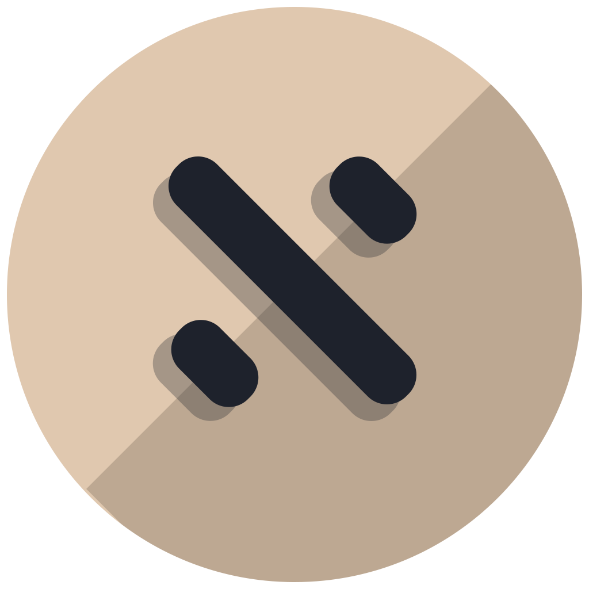

NETWORK
<h1>友链</h1>
持续收藏启发我、帮助我学习与创作的网站。

<a class="friend-card" href="https://savia7582.github.io/Exterior/" target="_blank" rel="noopener">
  
  

    
Savia的外装代脑

    
一位大佬的学习笔记集成网站

    
savia7582.github.io/Exterior

  

</a>

<a class="friend-card" href="https://note.tonycrane.cc/" target="_blank" rel="noopener">
  
  

    
鹤翔万里的笔记本

    
一位CSer大佬的笔记本

    
note.tonycrane.cc

  

</a>

<a class="friend-card" href="https://note.isshikih.top/" target="_blank" rel="noopener">
  
  

    
Isshiki修的笔记本

    
另一位CSer大佬的笔记本

    
note.isshikih.top

  

</a>

